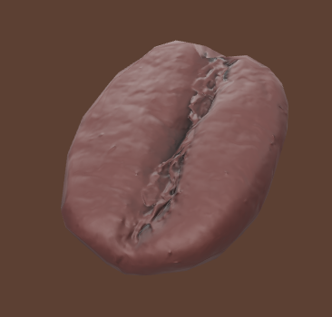

# ☕ Three.js Coffee Bean

A simple Three.js project showcasing an optimized 3D coffee bean model with realistic lighting, normal mapping, and smooth animations.

The project focuses on achieving a high-quality visual result while keeping the model lightweight for fast loading and web performance.



## ✨ Features

- Optimized GLB model (~52 KB)
- Draco-compressed geometry
- Normal map and Ambient Occlusion (AO) for added surface detail
- Studio-style lighting setup
- Physically based rendering (PBR) materials
- Environment reflections using `RoomEnvironment`
- Smooth drop-in entrance animation
- OrbitControls with damping
- Responsive canvas
- Soft shadows

## 🛠 Technologies

- three.js
- Vite
- GLTFLoader
- DRACOLoader
- OrbitControls
- RoomEnvironment

## 📦 Installation

Clone the repository:

```bash
git clone https://github.com/Azdast/coffee-been
cd coffee-been
```

Install dependencies:

```bash
npm install
```

Start the development server:

```bash
npm run dev
```

Then open the local URL provided by Vite.

## 🎨 Rendering

The scene uses:

- ACES Filmic tone mapping
- sRGB color management
- Studio-inspired lighting (key, fill, rim, and kicker lights)
- Environment lighting via PMREM
- Soft PCF shadows

The coffee bean uses physically based materials with adjusted roughness and metalness to better resemble a real roasted coffee bean.

## 🚀 Performance

The project is optimized for fast loading:

| Asset                |             Size |
| -------------------- | ---------------: |
| Coffee Bean Model    |           ~52 KB |
| Geometry Compression |            Draco |
| Texture Optimization | Normal + AO maps |

The goal was to create a visually appealing asset while keeping download size extremely small.
